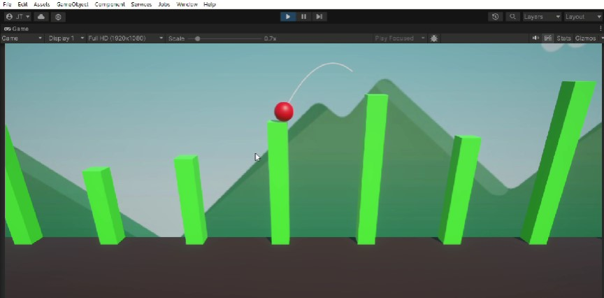

# Slingshot Ball Game

## Overview

A Unity game where you use a slingshot to propel a ball between pipe platforms. The game challenges your aiming and timing skills.

## Features

- Slingshot mechanic for launching the ball
- Pipe platforms with different challenges
- Realistic physics

## Play

After starting the game, use the mouse to drag the slingshot and adjust the tension. Release to launch the ball. Aim for the pipe platforms to score points.
